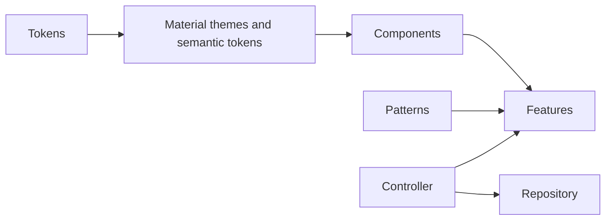

# Flutter Design System · Nusantara UI

[](https://github.com/muhamien/flutter-design-system/actions/workflows/ci.yml)

An open-source Flutter starter for customizing **Material 3** without coupling reusable UI to business logic. MIT licensed.

This repository contains a reusable design system package and a runnable component catalog with a repository/controller feature example. It is a starter, not an exhaustive component library.

## What's included

- Brand seeds, spacing, radius, layout, and motion tokens.
- Material `ColorScheme`, `TextTheme`, and component themes.
- A semantic success-color `ThemeExtension`, including theme interpolation.
- `DsButton` (variants, loading, disabled), `DsTextField`, `DsNotice`, and `DsPage`.
- Light, dark, and system theme modes with two illustrative brands.
- Profile form with validation, asynchronous saving, failure feedback, and retry.
- Automated checks and a web build in GitHub Actions.

## Quick start

Use **Flutter 3.32.8 / Dart 3.8**, the baseline pinned in CI and `.fvmrc`. FVM is optional. See the [official Flutter installation documentation](https://docs.flutter.dev/install).

```sh
git clone https://github.com/muhamien/flutter-design-system.git
cd flutter-design-system
./tool/bootstrap.sh
cd apps/catalog
flutter run -d chrome
```

The committed web runner makes the catalog runnable without generating a platform. For Android/iOS, run `flutter create --platforms=android,ios --project-name=nusantara_catalog .` in `apps/catalog` and configure the corresponding native toolchain. Preserve the existing app source and dependencies.

In the profile form, enter a name to try success or enter `error` to simulate an API failure. The adapter uses an artificial delay and does not persist data. Theme preferences are also in memory.

## Architecture

```text
packages/nusantara_ui/
  lib/src/tokens/       Primitive design values
  lib/src/theme/        Semantic roles and Material component themes
  lib/src/components/   Shared UI contracts
  lib/src/patterns/     Generic layout composition

apps/catalog/
  lib/main.dart        App configuration and component catalog
  lib/features/profile/
    domain/            Repository contract
    data/              Demo repository adapter
    presentation/      Controller, immutable state, and form
```

Feature code depends on the design system. The design system does not depend on feature code, API clients, routers, or state management libraries.



Read [the architecture guide in Indonesian](docs/architecture.md) and [the design decision](docs/decisions/001-material-foundation.md).

## Use in your app

```yaml
dependencies:
  nusantara_ui:
    path: ../../packages/nusantara_ui
```

```dart
import 'package:flutter/material.dart';
import 'package:nusantara_ui/nusantara_ui.dart';

MaterialApp(
  theme: DsTheme.build(brand: DsBrand.ocean),
  darkTheme: DsTheme.build(
    brand: DsBrand.ocean,
    brightness: Brightness.dark,
  ),
  themeMode: ThemeMode.system,
  home: myHomePage,
);
```

```dart
DsButton(
  label: 'Save profile',
  isLoading: state.isSaving,
  onPressed: controller.save,
);
```

`myHomePage`, `state`, and `controller` are owned by the consuming app. Use the catalog for a complete working integration. The package is not published to pub.dev; Git/path dependencies can be used, preferably pinned to an immutable revision.

## Customize

- Change primitive values in `ds_tokens.dart`.
- Map colors and typography in `DsTheme.build`; consume semantic roles in widgets.
- Add custom semantic roles with `ThemeExtension` when Material has no matching role.
- Add wrappers for repeated behavior, not for every Material widget.
- Keep domain-specific cards, validation, navigation, and API calls in features.

`ColorScheme.fromSeed` generates tonal colors; its primary color may differ from the seed. Exact brand-color overrides need contrast checks on both foreground/background roles.

## Quality checks

```sh
./tool/check.sh
cd apps/catalog
flutter build web --release
```

CI checks formatting, analysis, package tests, feature tests, and a release web build. Test coverage includes loading protection, form validation, theme extensions, large text in narrow layouts, touch-target guidelines, profile success/failure/retry, and disposal during a pending request.

The component catalog is a baseline for manual review. Before production, check screen readers, keyboard focus, text scaling, color contrast, target platforms, and real product content. Golden screenshots and native integration tests are not included yet.

## Contributing

See [CONTRIBUTING.md](CONTRIBUTING.md). Bug reports, new component proposals, and pull requests are welcome in English or Indonesian. Breaking API changes should include migration instructions.

## License

[MIT](LICENSE) · Copyright 2026 Muhammad Amien.
