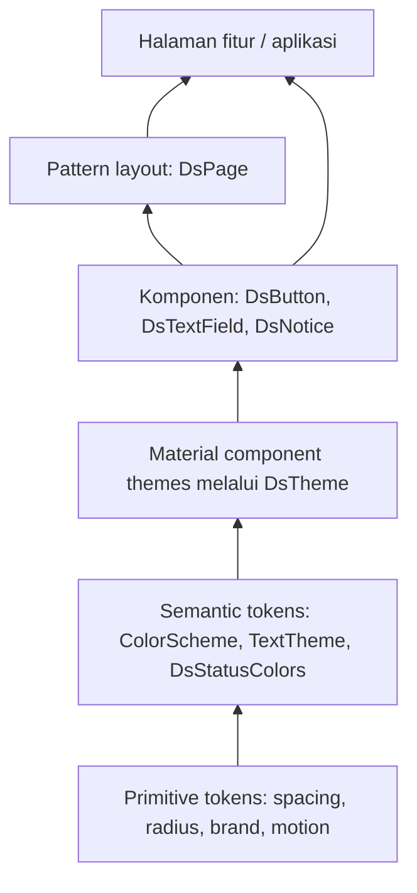

# Nusantara UI — arsitektur design system Flutter

Contoh fondasi design system dengan kustomisasi Material 3. Ditujukan untuk tim yang membutuhkan konsistensi visual, komponen reusable, light/dark mode, dan pemakaian lintas aplikasi. Brand dan warna pada contoh adalah ilustrasi.

## Arsitektur



Panah menunjukkan aliran konfigurasi. Lapisan atas boleh memakai API lapisan bawah. Design system tidak mengimpor fitur, model domain, repository, router, atau state management aplikasi.

| Lapisan | Tanggung jawab | Contoh |
|---|---|---|
| Primitive tokens | Nilai desain dasar | `DsSpace.md`, `DsRadius.control`, `DsBrand.ocean` |
| Semantic tokens | Makna warna dan gaya | `colorScheme.primary`, `textTheme.bodyLarge`, `DsStatusColors` |
| Material themes | Konfigurasi default widget Material | FilledButton, input, card, snackbar |
| Komponen | API UI berulang dengan state yang konsisten | Tombol loading, input, notice |
| Pattern | Komposisi layout generik | Halaman scroll dengan batas lebar konten |
| Fitur | Data, validasi bisnis, API, navigasi | Form profil pada aplikasi demo |

Warna brand mentah menjadi seed `ColorScheme.fromSeed`; warna hasilnya tidak selalu sama persis dengan seed. Pakai pasangan seperti `primary/onPrimary` dan `errorContainer/onErrorContainer`. Jika brand memerlukan warna persis, override pasangan warna secara bersama dan ukur kontrasnya.

`ColorScheme` menangani peran Material yang tersedia. `ThemeExtension` hanya digunakan untuk peran tambahan seperti success, dengan `copyWith` dan `lerp` supaya ikut transisi tema. Spacing dan radius saat ini konstan; jika berbeda per brand/density, pindahkan ke ThemeExtension tersendiri.

## Organisasi repositori

Package berada di `packages/nusantara_ui`, sedangkan katalog berada di `apps/catalog`.
Fitur profil memisahkan `domain` (kontrak repository), `data` (adapter simulasi), dan
`presentation` (controller, state, form). Controller menerima repository melalui
constructor. Implementasi HTTP nyata dapat mengganti adapter tanpa mengubah DS.

Jalankan `./tool/bootstrap.sh`, kemudian `flutter run -d chrome` di `apps/catalog`.
Flutter 3.32.8 dipin pada CI dan `.fvmrc`. Jalankan pemeriksaan dengan `./tool/check.sh`.

## Integrasi ke aplikasi

Tambahkan dependency lokal:

```yaml
dependencies:
  nusantara_ui:
    path: ../../packages/nusantara_ui
```

Pasang tema di root aplikasi:

```dart
import 'package:flutter/material.dart';
import 'package:nusantara_ui/nusantara_ui.dart';

MaterialApp(
  theme: DsTheme.build(brand: DsBrand.ocean),
  darkTheme: DsTheme.build(
    brand: DsBrand.ocean,
    brightness: Brightness.dark,
  ),
  themeMode: ThemeMode.system,
  home: const ProfilePage(),
);
```

Gunakan komponen di fitur:

```dart
DsButton(
  label: 'Simpan profil',
  isLoading: state.isSaving,
  onPressed: state.canSave ? controller.saveProfile : null,
);
```

Potongan ini menunjukkan integrasi; `ProfilePage`, `state`, dan `controller` adalah milik aplikasi. Contoh lengkap yang berdiri sendiri berada di `apps/catalog/lib/main.dart`.

## Aturan pengembangan

1. Feature memakai public import `package:nusantara_ui/nusantara_ui.dart`; hindari import `src`.
2. Perubahan gaya global masuk tema/token. Jangan menyebarkan hex warna atau `ButtonStyle` per halaman.
3. Bungkus Material widget ketika ada kontrak berulang, misalnya loading atau varian intent. Widget Material lain tetap boleh dipakai langsung karena sudah menerima tema global.
4. API komponen memakai intent (`primary`, `secondary`, `error`), bukan parameter warna bebas. Tambahkan escape hatch hanya jika kebutuhannya terbukti.
5. Komponen menerima callback dan data presentasi. Komponen tidak memanggil API, membaca provider bisnis, atau menjalankan navigasi domain.
6. Untuk template spesifik domain, seperti ringkasan pesanan atau kartu rekening, letakkan di fitur atau package domain terpisah. Pattern DS harus tetap generik.
7. Tambahkan state baru ke katalog sebelum digunakan luas. Dokumentasikan default, pressed, focused, disabled, loading, error, dan perilaku keyboard yang relevan.
8. Font khusus dibundel sebagai asset package, termasuk lisensinya; mapping tetap menggunakan peran TextTheme. Contoh ini memakai font default agar tanpa dependency eksternal.

## Aksesibilitas dan pengujian

Kontrol tombol memakai minimum 48 logical pixels dan target tap Material padded. Teks tidak diberi tinggi tetap atau skala paksa; notice memakai Expanded, tombol memakai Wrap, dan halaman dapat discroll. Ikon status disertai pesan teks, serta pesan loading/status menggunakan semantics live region.

Ini adalah fondasi, bukan sertifikasi aksesibilitas. Sebelum rilis lakukan pemeriksaan screen reader, keyboard/focus, kontras warna, text scale hingga 200%, serta lebar 320/840/1440. Uji string panjang dan bahasa RTL bila produk mendukungnya.

Test memeriksa registrasi/interpolasi status theme, pencegahan submit ketika loading,
penerusan validator form, target tap, layout sempit dengan teks besar, serta alur
controller dan form profil. CI menjalankan analyze/test dan build web pada SDK yang dipin.

Untuk tim produksi, tambahkan golden test komponen penting pada kedua brightness dan screenshot halaman kritis pada text scale besar. Jalankan format/analyze/test pada SDK yang dipin di CI. Kunci golden test pada platform dan font yang konsisten.

## Pengembangan berikutnya

- Tambahkan katalog halaman input, dialog, empty state, dan feedback sesuai kebutuhan nyata.
- Saat kebutuhan multi-brand berkembang, ubah DsBrand menjadi konfigurasi immutable untuk warna, font, dan shape. Uji semua kombinasi brand/tema.
- Gunakan semantic versioning untuk public API; deprecate sebelum menghapus properti/komponen. Catat perubahan visual walaupun API tidak berubah.
- Simpan spesifikasi token yang sama pada desain dan kode, dengan reviewer dari desain serta engineering.
- Pilih state management dan router pada aplikasi secara terpisah; design system tidak menentukan Riverpod/Bloc atau go_router.

## Referensi resmi

- [Flutter themes](https://docs.flutter.dev/cookbook/design/themes)
- [ThemeData](https://api.flutter.dev/flutter/material/ThemeData-class.html)
- [ColorScheme.fromSeed](https://api.flutter.dev/flutter/material/ColorScheme/ColorScheme.fromSeed.html)
- [ThemeExtension](https://api.flutter.dev/flutter/material/ThemeExtension-class.html)
- [Flutter accessibility](https://docs.flutter.dev/ui/accessibility)
